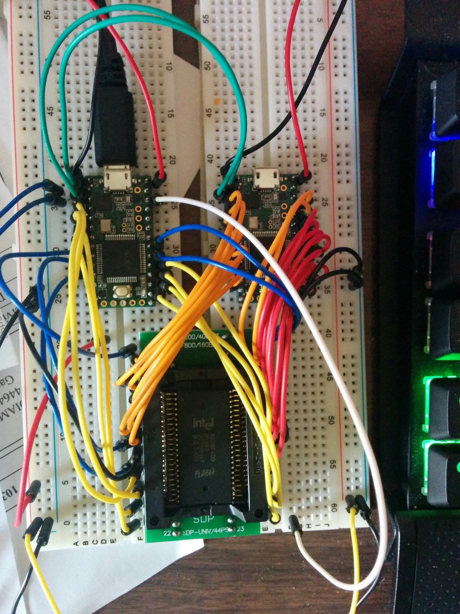
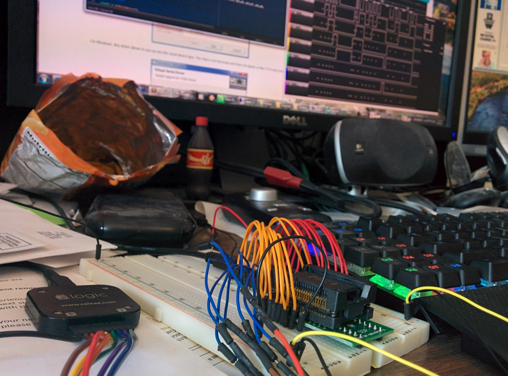

# TeensyDump

A setup to use two Teensy 3.1 microprocessors to dump an Intel 28F400 NOR FLASH
chip.

## Why?

Always with the why? Because my ancient Dataman S4 doesn't support the 44-pin
PSOP package, but I happen to have a socket that fits in a breadboard, so...

### Why _TWO_ Teensys?

Oh, right. A single Teensy does have enough digital I/O, but only if you solder
to the pads on the back. Not the most breadboard friendly. So I use one Teensy
to set the address pins when commended over serial from the other Teensy.

### Isn't that slow?

Not as slow as you'd think. I set the Teensys to use 6,000,000 baud for serial,
which works pretty well. You do have to overclock them to 96 MHz for that to
work right.

## Results

Everything seems to work fine. I can dump the chip in about 45 seconds, which
isn't blindingly fast, but is plenty quick for my purposes. I suspect I could
optimize this process greatly by tightening up timings and getting creative with
the address pins, but I don't think the complexity and development time is worth
saving a few seconds the few times I will actually use this setup.

Writing the chip could certainly be faster (takes a couple minutes), but I think
the driving factor is actually the program time on the array, not the sketchy
interface provided here.

## Schematics

I'll get to it, probably. Honestly, just read the pin definitions in the source
code, and follow the datasheet for the 28F400. It is pretty straightforward.

For now, just check out the wiring in the images below. Also check out that
sweet Logic timing graph from a test dump!

